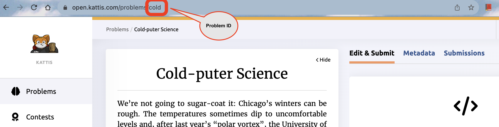
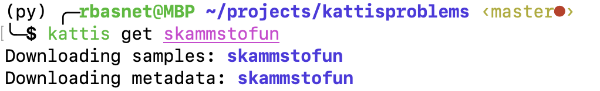
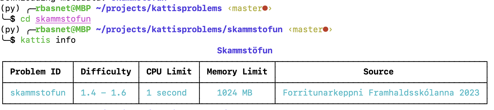
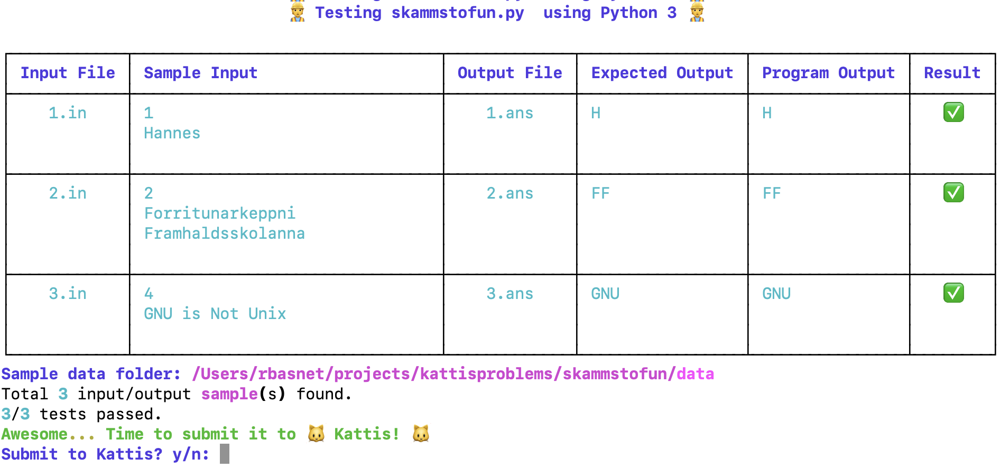
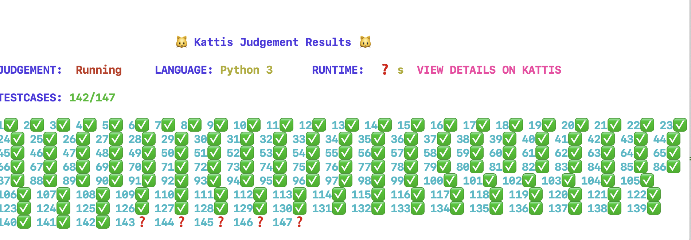
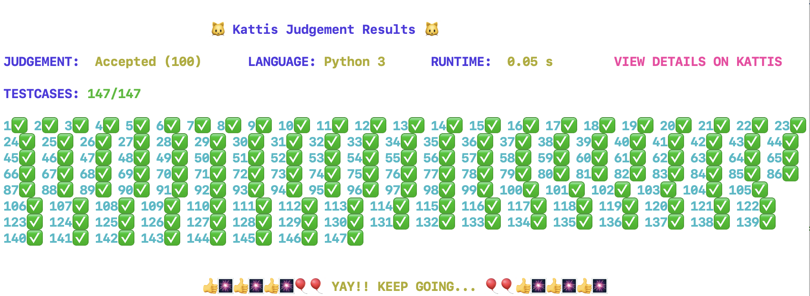

# Kattis-CLI

Kattis CLI - download, test and submit Kattis problems using CLI.
Based on Official Kattis CLI: [https://github.com/Kattis/kattis-cli](https://github.com/Kattis/kattis-cli)

## Requirements

- Python 3.8+ (PyPy preferred as Kattis uses PyPy to run your code)
- [Kattis account](https://open.kattis.com/login/email)

## Windows

- Use Command Line or PowerShell
- Make sure python is in your PATH
- if you get codec error while running kattis-cli, run the following command in Command Prompt:

```bash
python --version
chcp 65001
```

## Installation

If you've Python version 3.8 or higher, you can skip creating virtual environment. If you wish to create a virtual environment, see intructions below.


### Create and activate virtual environment using venv

- follow the instruction provided in the link to create and activate virtual environment:
[https://packaging.python.org/en/latest/guides/installing-using-pip-and-virtual-environments/](https://packaging.python.org/en/latest/guides/installing-using-pip-and-virtual-environments/)


### Create and activate virtual environment using conda

- follow the instruction provided in the link to create and activate virtual environment:
[https://conda.io/projects/conda/en/latest/user-guide/tasks/manage-environments.html#activating-an-environment](https://conda.io/projects/conda/en/latest/user-guide/tasks/manage-environments.html#activating-an-environment)

## Install Kattis-cli

- activate virtual environment if you've created one for kattis-cli
- run the following command in Command Prompt or PowerShell

```bash
pip install kattis-cli
python -m pip install kattis-cli
```

## Update Kattis-CLI

- remove or rename **.kattis-cli.toml** file in your home directory
- activate virtual environment if you've created one for kattis-cli

```bash
pip install kattis-cli --upgrade
python -m pip install kattis-cli --upgrade
```

## Kattis configuration

- run the following command and enter your Kattis credentials
- this will create a .kattisrc file in your home directory


```bash
kattis setup
```

## Usage

```bash
kattis <command> [options]
kattis --help
```

### Commands

### Download a problem sample files and it's metadata

- problem id can be found in the last part of the URL of the problem
- example: [https://open.kattis.com/problems/cold](https://open.kattis.com/problems/cold) => problem id: **cold**



```bash
kattis get <problem_id>
```



### Display problem metadata

```bash
cd <problem_id>
kattis info
```



### Test a solution locally

- currently the following languages have been tested: Python 3, C++, NodeJS, C
- make sure CLI compilers are in your PATH
- make sure python3 files have first line shebang: !/usr/bin/env python3
    - or have extensions .py3
- update the **.kattis-cli.toml** file in your home directory to add more languages
- see [kattis_cli/.kattis-cli.toml](https://github.com/rambasnet/kattis-cli/blob/main/kattis_cli/.kattis-cli.toml) file for example.

```bash
cd <problem_id>
kattis test
```



### Submit a problem

- make sure you've configured kattis-cli

```bash
kattis setup
```

- see live results right on the terminal

```bash
cd <problem_id>
kattis submit
```




## Contributing

Pull requests are welcome. For major changes, please open an issue first to discuss what you would like to change. Please make sure to update tests as appropriate. Adding support for more languages is highly appreciated.


## Using this Repo

- clone this repo
- create virtual environment with pypy 3.8 or higher
- using conda the following command creates kattis virtual environment with pypy3.8

```bash
conda create -c conda-forge -n kattis pypy python=3.8
conda activate kattis
```

- install dependencies

```bash
pip install -r requirements.txt
```

- run the following command to install kattis-cli from this repo on Mac/Linux

```bash
make
./build.sh
pip install dist/kattis_cli-x.x.x-py3-none-any.whl --force-reinstall  
```
