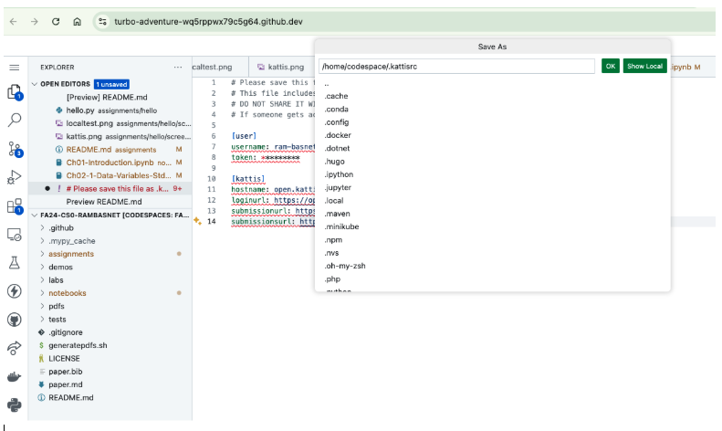
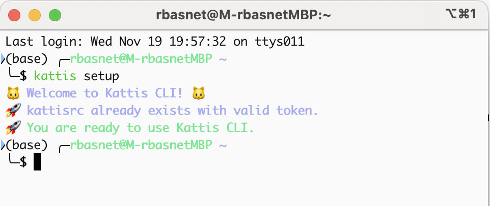

# Setting up Kattis and Kattis-cli

1. Create your Kattis account at [https://open.kattis.com](https://open.kattis.com) if you don't have one.

2. Login to [https://open.kattis.com](https://open.kattis.com).

3. Install kattis-cli Python package [https://github.com/rambasnet/kattis-cli](https://github.com/rambasnet/kattis-cli) using pip from a Terminal

- install

```bash
python3 -m pip install kattis-cli
```

- upgrade to new version if you have already installed kattis-cli

```bash
python3 -m pip install --upgrade kattis-cli
```

4. Copy your personal configuration content from: [https://open.kattis.com/download/kattisrc](https://open.kattis.com/download/kattisrc)

## Save your Kattis configuration file

### Codespaces setup

1. Click Hamburger Menu (3 stacked lines) > File > New Text File
2. Copy and paste the kattisrc content and save the file as: `/home/codespace/.kattisrc`
   - Note period prefix; `/home/codespace/` folders already exist in your Codespaces
     
3. Click OK

### Check Configuration

- test Kattis authentication setup, by typing the following on a Terminal
- you should see the output provided in the image

```bash
kattis setup
```



For Kattis-cli help and subcommands, just type kattis on the Terminal:

```bash
kattis --help
```
